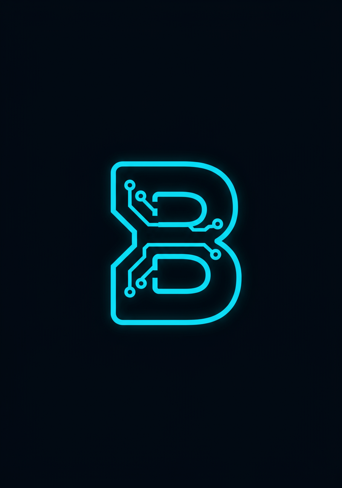

# 🚀 Brijesh Portfolio

<div align="center">
  
  
  
  [](https://brijesh-portfolio.netlify.app)
  [](https://opensource.org/licenses/MIT)
  [](https://developer.mozilla.org/en-US/docs/Web/HTML)
  [](https://developer.mozilla.org/en-US/docs/Web/CSS)
  [](https://developer.mozilla.org/en-US/docs/Web/JavaScript)
  [](https://vitejs.dev/)
</div>

## 📖 Brief Description

A modern, interactive personal portfolio website showcasing my journey as a Computer Science student and aspiring Data Scientist. Built with cutting-edge web technologies and featuring stunning 3D animations, glassmorphism effects, and responsive design.

---

## 📋 Table of Contents

- [✨ Features](#-features)
- [🎥 Demo & Screenshots](#-demo--screenshots)
- [🛠️ Installation](#️-installation)
- [🚀 Usage](#-usage)
- [🎨 Customization](#-customization)
- [🤝 Contributing](#-contributing)
- [📄 License](#-license)
- [📞 Contact & Support](#-contact--support)
- [🙏 Acknowledgments](#-acknowledgments)

---

## ✨ Features

### 🎯 **Core Functionality**
- 📱 **Fully Responsive Design** - Optimized for all devices (mobile, tablet, desktop)
- 🎨 **Modern UI/UX** - Glassmorphism effects, smooth animations, and contemporary styling
- 🚀 **Performance Optimized** - Fast loading times with lazy loading and optimized assets
- ♿ **Accessibility Focused** - WCAG compliant with proper semantic HTML

### 🎭 **Interactive Elements**
- 🤖 **3D Spline Model** - Interactive robot animation in the hero section
- 🌊 **Smooth Scrolling** - Seamless navigation between sections
- 📊 **Animated Skill Bars** - Dynamic progress indicators with intersection observer
- 🎪 **AOS Animations** - Scroll-triggered animations throughout the site

### 🎨 **Visual Design**
- 🌈 **Gradient Animations** - Dynamic color transitions and effects
- 💎 **Glassmorphism Header** - Translucent navigation with backdrop blur
- 🎯 **Hover Effects** - Interactive buttons and social media icons
- 🌟 **Loading Animation** - Custom SVG loader with brand colors

### 📱 **Sections Included**
- 🏠 **Hero Section** - Introduction with 3D model and call-to-action
- 👨‍💻 **About Me** - Personal story and background
- 🚀 **Projects** - Showcase of key development projects
- 🛠️ **Skills** - Technical abilities with animated progress bars
- 🎓 **Resume** - Education timeline and downloadable CV
- 📞 **Contact** - Social media links with animated buttons

---

## 🎥 Demo & Screenshots

### 🌐 **Live Demo**
👉 **[View Live Portfolio](https://brijesh-portfolio.netlify.app)**

### 📸 **Screenshots**

<details>
<summary>🖥️ Desktop View</summary>


*Hero section with 3D model and glassmorphism header*


*Projects showcase with hover effects*

</details>

<details>
<summary>📱 Mobile View</summary>


*Responsive mobile design*


*Mobile-optimized navigation*

</details>

### 🎬 **Features in Action**
- ⚡ **Fast Loading** - Optimized performance with Vite
- 🎯 **Smooth Animations** - 60fps animations with hardware acceleration
- 📱 **Touch Friendly** - Optimized for mobile interactions

---

## 🛠️ Installation

### 📋 **Prerequisites**
- 📦 **Node.js** (v16.0.0 or higher)
- 📦 **npm** (v7.0.0 or higher) or **yarn**
- 🌐 **Modern web browser** (Chrome, Firefox, Safari, Edge)

### ⚡ **Quick Start**

```bash
# Clone the repository
git clone https://github.com/tenacious7/brijesh-portfolio.git

# Navigate to project directory
cd brijesh-portfolio

# Install dependencies
npm install

# Start development server
npm run dev
```

### 🔧 **Detailed Installation**

<details>
<summary>📝 Step-by-step guide</summary>

1. **Clone the Repository**
   ```bash
   git clone https://github.com/tenacious7/brijesh-portfolio.git
   cd brijesh-portfolio
   ```

2. **Install Dependencies**
   ```bash
   # Using npm
   npm install
   
   # Or using yarn
   yarn install
   ```

3. **Environment Setup**
   ```bash
   # Copy environment template (if applicable)
   cp .env.example .env
   ```

4. **Start Development Server**
   ```bash
   npm run dev
   ```

5. **Open in Browser**
   - Navigate to `http://localhost:8000`
   - The site will automatically reload on changes

</details>

### 🏗️ **Build for Production**

```bash
# Build optimized production version
npm run build

# Preview production build locally
npm run preview
```

---

## 🚀 Usage

### 🎯 **Development Workflow**

```bash
# Start development server with hot reload
npm run dev

# Build for production
npm run build

# Preview production build
npm run preview
```

### 📁 **Project Structure**

```
brijesh-portfolio/
├── 📁 assets/              # Static assets (images, icons)
│   ├── 🖼️ gradient.png     # Background gradient
│   ├── 🖼️ favicon.png      # Site favicon
│   └── 🖼️ project-*.webp   # Project screenshots
├── 📄 index.html           # Main HTML file
├── 🎨 styles.css           # Main stylesheet
├── ⚡ script.js            # JavaScript functionality
├── ⚙️ vite.config.js       # Vite configuration
├── 📦 package.json         # Dependencies and scripts
└── 📖 README.md           # Project documentation
```

### 🎨 **Key Components**

<details>
<summary>🧩 Component Breakdown</summary>

#### **Header Component**
```css
/* Glassmorphism navigation */
header {
  background: rgba(255, 255, 255, 0.05);
  backdrop-filter: blur(20px);
  /* ... */
}
```

#### **3D Model Integration**
```html
<!-- Spline 3D Model -->
<spline-viewer
  class="robot-3d"
  url="https://prod.spline.design/PKaBruzFCvVi3TEL/scene.splinecode"
></spline-viewer>
```

#### **Animated Skills**
```javascript
// Skill bar animation
function animateSkillBar(skillBar) {
  const targetWidth = skillBar.dataset.width;
  // Animation logic...
}
```

</details>

---

## 🎨 Customization

### 🎯 **Personal Information**

Update your personal details in `index.html`:

```html
<!-- Update hero section -->
<h1>Hi There<br />I AM [YOUR NAME]</h1>
<p class="description">
  [YOUR PROFESSIONAL TAGLINE]<br />
  [YOUR SPECIALIZATION]
</p>
```

### 🎨 **Styling & Colors**

Customize the color scheme in `styles.css`:

```css
/* Primary gradient colors */
:root {
  --primary-gradient: linear-gradient(45deg, #7f00ff, #e100ff);
  --accent-color: #7f00ff;
  --text-primary: #fff;
  --text-secondary: #a8b2d1;
}
```

### 🚀 **Adding Projects**

Add new projects in the projects section:

```html
<div class="project-item" data-aos="fade-up">
  <div class="project-image-container">
    
  </div>
  <div class="project-content">
    <h3 class="project-title">Your Project Name</h3>
    <p class="project-description">Project description...</p>
    <!-- ... -->
  </div>
</div>
```

### 📱 **Social Media Links**

Update social media links in the contact section:

```html
<a href="https://linkedin.com/in/your-profile" class="social-btn linkedin">
<a href="https://github.com/your-username" class="social-btn github">
<a href="mailto:your-email@domain.com" class="social-btn email">
```

---

## 🤝 Contributing

We welcome contributions! Here's how you can help:

### 🐛 **Bug Reports**
- Use the [issue tracker](https://github.com/tenacious7/brijesh-portfolio/issues)
- Include browser version and steps to reproduce
- Provide screenshots if applicable

### 💡 **Feature Requests**
- Check existing issues first
- Describe the feature and its benefits
- Consider implementation complexity

### 🔧 **Pull Requests**

1. **Fork the repository**
2. **Create a feature branch**
   ```bash
   git checkout -b feature/amazing-feature
   ```
3. **Make your changes**
4. **Test thoroughly**
5. **Commit with clear messages**
   ```bash
   git commit -m "Add amazing feature"
   ```
6. **Push to your fork**
   ```bash
   git push origin feature/amazing-feature
   ```
7. **Open a Pull Request**

### 📋 **Development Guidelines**
- Follow existing code style
- Test on multiple browsers
- Ensure mobile responsiveness
- Update documentation as needed

---

## 📄 License

This project is licensed under the **MIT License** - see the [LICENSE](LICENSE) file for details.

```
MIT License

Copyright (c) 2025 Brijesh Kumar Ghadei

Permission is hereby granted, free of charge, to any person obtaining a copy
of this software and associated documentation files (the "Software"), to deal
in the Software without restriction, including without limitation the rights
to use, copy, modify, merge, publish, distribute, sublicense, and/or sell
copies of the Software...
```

---

## 📞 Contact & Support

### 👨‍💻 **Maintainer**
**Brijesh Kumar Ghadei**
- 🌐 **Portfolio**: [brijesh-portfolio.netlify.app](https://brijesh-portfolio.netlify.app)
- 💼 **LinkedIn**: [linkedin.com/in/brijesh-kumar-ghadei](https://www.linkedin.com/in/brijesh-kumar-ghadei)
- 🐙 **GitHub**: [github.com/tenacious7](https://github.com/tenacious7)
- 📧 **Email**: [brijesghadei313@gmail.com](mailto:brijesghadei313@gmail.com)
- 📸 **Instagram**: [@brijesh.bilu](https://www.instagram.com/brijesh.bilu/)

### 🆘 **Support**
- 📋 **Issues**: [GitHub Issues](https://github.com/tenacious7/brijesh-portfolio/issues)
- 💬 **Discussions**: [GitHub Discussions](https://github.com/tenacious7/brijesh-portfolio/discussions)
- 📖 **Documentation**: This README and inline code comments

### 🐛 **Reporting Issues**
When reporting issues, please include:
- Browser and version
- Operating system
- Steps to reproduce
- Expected vs actual behavior
- Screenshots (if applicable)

---

## 🙏 Acknowledgments

### 🛠️ **Technologies & Libraries**
- ⚡ **[Vite](https://vitejs.dev/)** - Lightning fast build tool
- 🎭 **[AOS](https://michalsnik.github.io/aos/)** - Animate On Scroll library
- 🤖 **[Spline](https://spline.design/)** - 3D design and animation
- 🎨 **[CSS3](https://developer.mozilla.org/en-US/docs/Web/CSS)** - Modern styling capabilities
- ⚡ **[JavaScript ES6+](https://developer.mozilla.org/en-US/docs/Web/JavaScript)** - Modern JavaScript features

### 🎨 **Design Inspiration**
- 💎 **Glassmorphism** design trend
- 🌈 **Modern gradient** aesthetics
- 📱 **Mobile-first** responsive design principles
- ♿ **Accessibility** best practices

### 🖼️ **Assets & Resources**
- 🖼️ **[Pexels](https://pexels.com)** - High-quality stock photos
- 🎨 **Custom gradients** and animations
- 🤖 **Custom 3D models** via Spline

### 🌟 **Special Thanks**
- 🎓 **Centurion University** - Educational foundation
- 👥 **Open Source Community** - Inspiration and resources
- 🤖 **AI Assistants** - Development support and guidance
- 🌐 **Web Development Community** - Best practices and standards

---

<div align="center">
  
### 🌟 **Star this repository if you found it helpful!**

[](https://github.com/tenacious7/brijesh-portfolio/stargazers)
[](https://github.com/tenacious7/brijesh-portfolio/network/members)

**Made with ❤️ by [Brijesh Kumar Ghadei](https://github.com/tenacious7)**

</div>

---

*Last updated: January 2025*